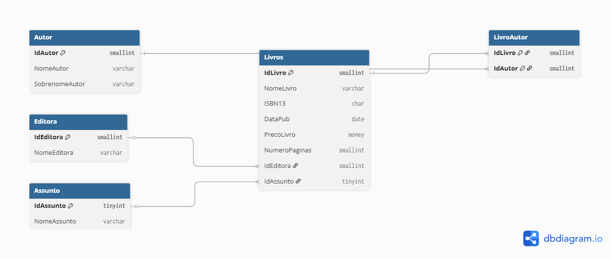

# 📚 Projeto Banco de Dados - Biblioteca

## 📌 Descrição

Este projeto consiste na modelagem de um banco de dados para gerenciamento de uma biblioteca, incluindo autores, livros, editoras e assuntos.

## 🧱 Estrutura do Banco

* Autor
* Livros
* Editora
* Assunto
* LivroAutor (relacionamento N:N)

## 🔗 Relacionamentos

* Um livro pertence a uma editora
* Um livro possui um assunto
* Um livro pode ter vários autores

## 📊 Diagrama



## 🚀 Tecnologias utilizadas

* SQL Server
* SQL

## 💡 Funcionalidades demonstradas

* Criação de tabelas (DDL)
* Relacionamentos com FOREIGN KEY
* Chave primária composta
* Integridade de dados (CHECK, UNIQUE)

## 📁 Arquivos

* schema.sql → criação do banco
* queries.sql → consultas SQL com JOIN e agregações

## 🧪 Exemplos de consultas

```sql
SELECT l.NomeLivro, a.NomeAutor
FROM Livros l
JOIN LivroAutor la ON l.IdLivro = la.IdLivro
JOIN Autor a ON la.IdAutor = a.IdAutor;
